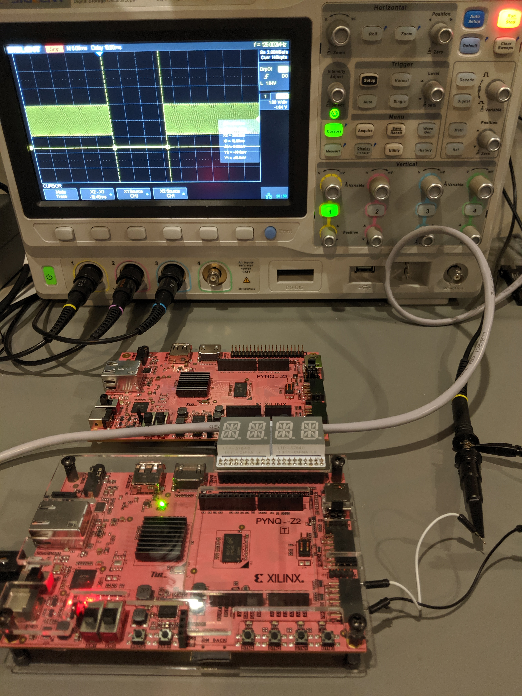
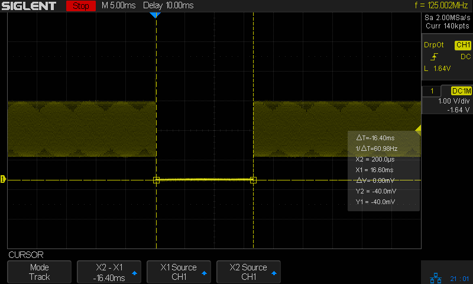

# Pynq-Z2 sysclk demo

This demonstrates the dropout of the sysclk on the Pynq-Z2 board which occurs
when running an HDL-only project.

This occurs on the Pynq-Z2 when creating an HDL-only project (no block design,
which implies the Zynq subsystem is not initialized) and Ethernet is not
connected.

## Experiment Setup

This project routes the sysclk out through port jb[0] (PMOD B pin 0).  The
output of the sysclk is monitored on an oscilloscope.

This shows PMOD B pin 0 connected to channel 1 of an oscilloscope.  The scope
trigger is set to "Dropout" with a trigger time of 20ns.  The timebase is set
to 5ms.

## Results

Dropouts occur every 2.89s and last for 16.4ms.

This shows a screen capture of the oscilloscope during sysclk dropout.

The sysclk is divided by 16 and routed through led[0].  The glitches in the
sysclk signal are visible via the flicker that occurs in the LED every 2.89s.

